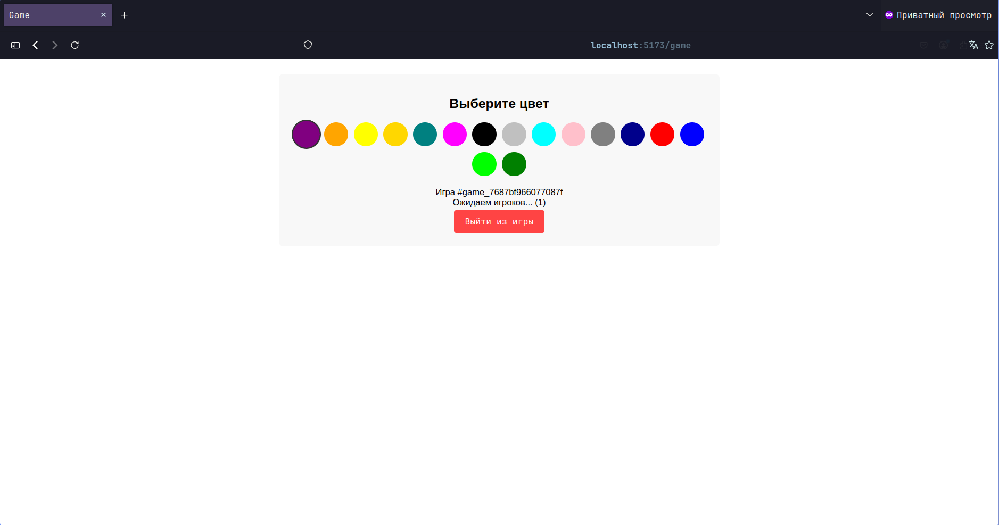

<h1 align="center">
  <a href="https://github.com/mloso/game">
    
  </a>
</h1>

<div align="center">
  game
  <br />
  <a href="#about"><strong>Explore the screenshots »</strong></a>
  <br />
  <br />
</div>

<details open="open">
<summary>Table of Contents</summary>

- [About](#about)
- [Getting Started](#getting-started)
    - [Prerequisites](#prerequisites)
    - [Installation](#installation)
- [Usage](#usage)

</details>

---

## About

> A game where the goal is to paint the largest number of fields by outrunning all players.
<details>
<summary>Screenshots</summary>
<br>

|                                                        Start Page                                                        |                                       Register Page                                        |
|:------------------------------------------------------------------------------------------------------------------------:|:------------------------------------------------------------------------------------------:|
|                                                    |                |
|                                                      Main Menu Page                                                      |                                    Color Selection Page                                    |
|                                            |  |
|                                           Another Player Color Selection Page                                            |                                         Game Page                                          |
|  |                        |
|                                                      Game Over Page                                                      |                                    Main Menu Stats Page                                    |
|                                            |  |

</details>

## Getting Started

### Prerequisites

> linux docker npm git

### Installation

```shell
git clone https://github.com/mloso/game && cd game
mv .env_dist .env  # edit your environment variables (optional)
docker compose -f docker/compose/alembic.yml -f docker/compose/database.yml -f docker/compose/networks.yml --env-file .env up --build --abort-on-container-exit
docker compose -f docker/compose/app.yml -f docker/compose/database.yml -f docker/compose/redis.yml -f docker/compose/networks.yml --env-file .env up --build
npm install
npm run build
npm run dev
```

## Usage

Go to browser and open link, that's hostname and port you're set upped (default - http://localhost:5713), for swagger
follow previous instruction and open `/docs` page (default - http://localhost:8080/docs)
